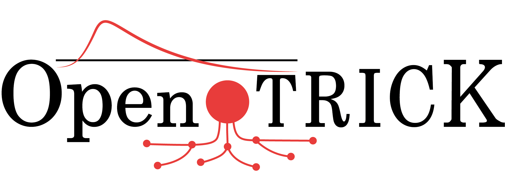

# About

OpenTRICK is a network-based risk analysis platform that allows to create risk scenarios with user-defined assets and risks.

This platform uses Java 17 for running the server software, along with a MySQL compatible database manager. This project uses code from the [Trick2Monarc api project](https://github.com/itrust-consulting/Trick2MonarcApi), available at GitHub.

To install OpenTRICK, please refer to the [installation guide](#install).

## Requirements

- Java 17;
- MySQL 8 / MariaDB;

## Build

OpenTRICK is provided as-is, and any customization is left at the discretion of the user. 
The recommended build platform for OpenTRICK is composed of:

- Java 17;
- Maven;
- Windows / Linux (or WSL) / Mac OS.

## Tools for development

OpenTRICK was developed as open-source software and utilizes the following tools:

- Visual Studio Code;
- Java 17;
- Maven;
- MySQL 8 / MariaDB;

# Install

Please refer to [installation guide](docs/INSTALL.md) for the installation process.

# Quick start

To begin using an already installed OpenTRICK instance, please refer to the [User Guide](./src/main/webapp/WEB-INF/static/views/user-guide.html#creating-a-risk-analysis-using-trick-service).

# Deployment

OpenTRICK can be deployed as a Java web application or a docker container. These methods have their own advantages and disadvantages that should be taken into consideration by the IT manager.

## Docker

To build the Docker image please refer to [the installation guide on how to create a docker image.](docs/INSTALL.md#create-a-docker-image)

## Java application

To build as a java application, please refer to [the installation guide on how to create a java application.](docs/installation/deployment/java/README.md#java-application)

# Roadmap
The team at itrust consulting is only responsible for resolving bugs. 
Improvements are made according to predefined schedule and priorities.

# License

Copyright © itrust consulting. All rights reserved.
Licensed under the GNU Affero General Public License (AGPL) v3.0.

# Acknowledgment
 This tool was co-funded by the Ministry of Economy and Foreign Trade of Luxembourg, within the project Cloud Cybersecurity Fortress of Open Resources and Tools for Resilience (CyFORT).

# Contact
For more information about the project, contact us at dev@itrust.lu.

