# Trick Service Installation Manual

Trick service is a web based application for creating risk analyses. This software uses Java 17 and Apache Tomcat or Jetty as page servers, as well as MariaDB for database management.

During the installation process, it will be assumed that Java 17 and that MariaDB are already installed in the destination computer, whereas Tomcat or Jetty will be installed along with Trick Service.

## Preparation

Using the CLI terminal of your system, create a directory to hold Trick Service source files and get into the directory.

```bash
mkdir TrickService
cd TrickService
```

After that, clone the GitHb project repository:

```bash
git clone [...]
```

## Build the project
    $ mvn clean compile


## Installation Using docker
    $ cd docs/installation/deployment/docker    
    Copy files deployment-example.env to deployment.env


    $ mvn clean spring-boot:build-image
    $ docker image tag docker.io/library/trickservice:2.17 trickservice.com/opentrick:latest


## Installation using conventional method


## Code compiling

Once the clone process is completed, Maven can be invoked and used to resolve the project dependencies.

```bash
mvn clean build
```

After Maven has completed the build process, the project can be compiled and run.

After compiling the project, open the system Internet browser and access the URL ```localhost:8080``` to access the PHP administration platform. The following window should appear.

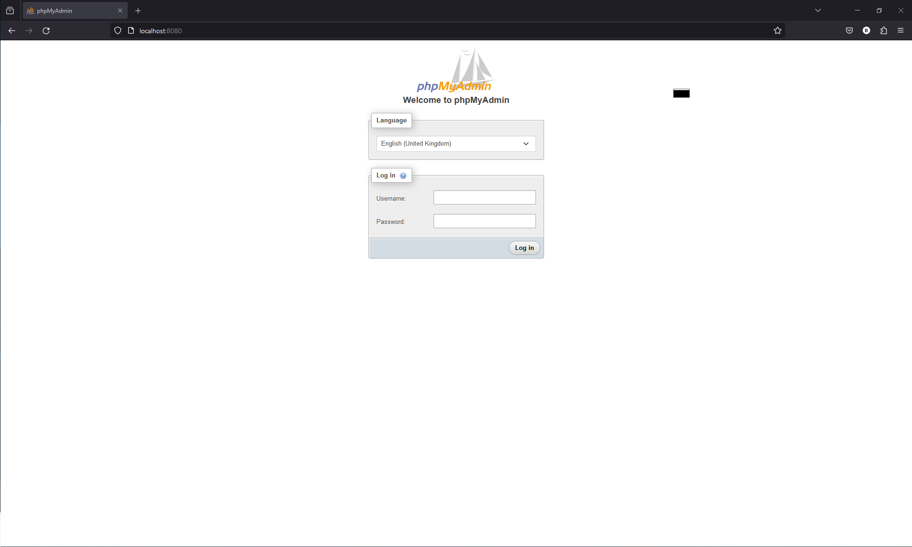

Enter ```root``` in both the Username and the Password fields. You should be able to log in to the PHP administration platform, showing the following screen:

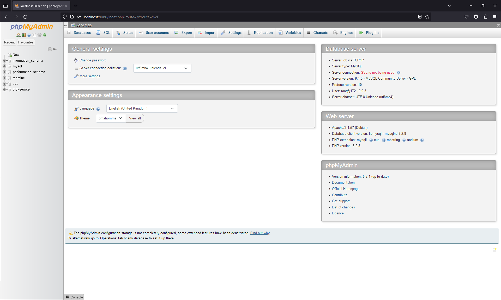

Click on 'Databases' on the top left of the window.

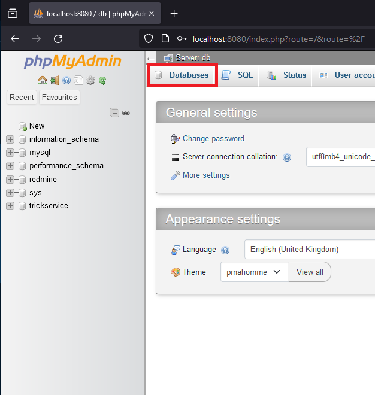

The Databases window should now be showing. Verify if the database trickservice is shown in the list of available databases, as shown below:

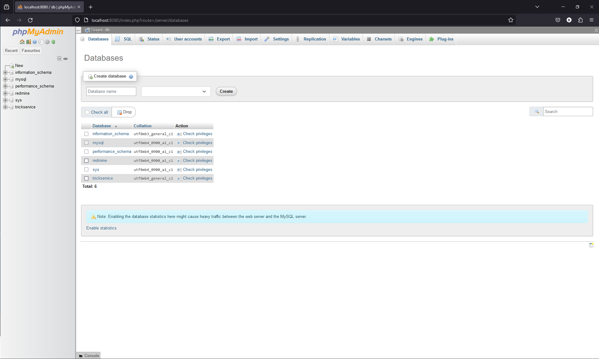

If not, create the needed database, using the ```Create database``` field. The name should be ```trickservice``` and the Collation should be ```utf8mb4_general_ci```, as shown below.

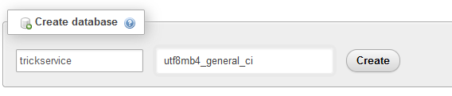

After that, the database ```trickservice``` should appear on the database list.

## Executing for the first time

After making sure that the database is configured, access the address ```localhost:8443``` and the Trick Service login page should appear.

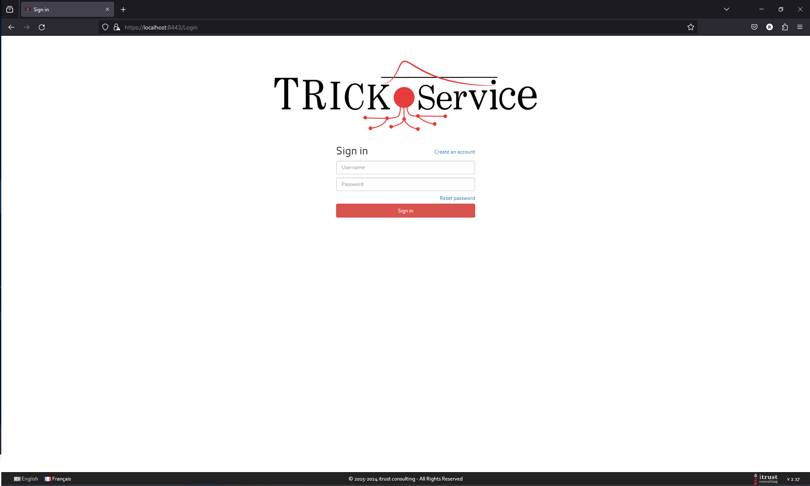

Click on "Create an account" (or "S'inscrire", if you are using the French version of the interface). 

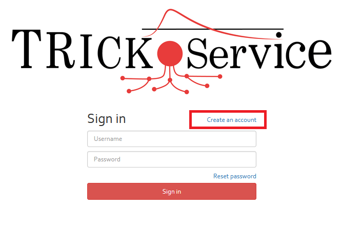

The "Create an Account" page should appear. Complete it with your data. **Passwords must have 12 characters, of which at least one uppercase letter, one lowercase letter and one number.**

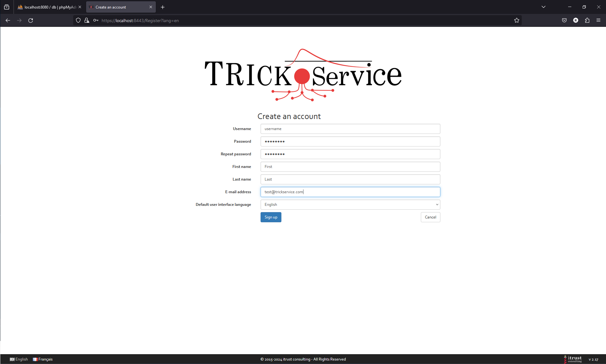

After account creation, Trick Service will log you in and display the initial screen. Click on Administration on the top right.

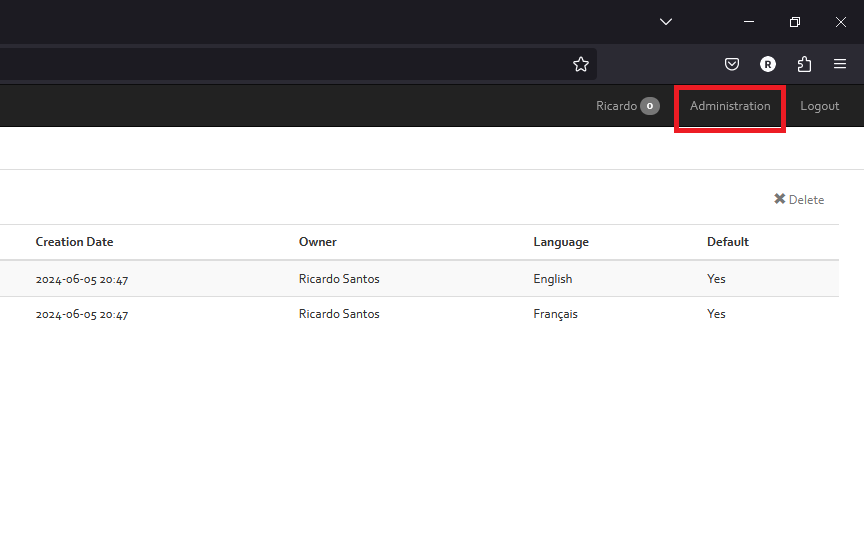

When the Administration page comes up, click on the ```Install TRICK Service``` button and wait for the process to complete.

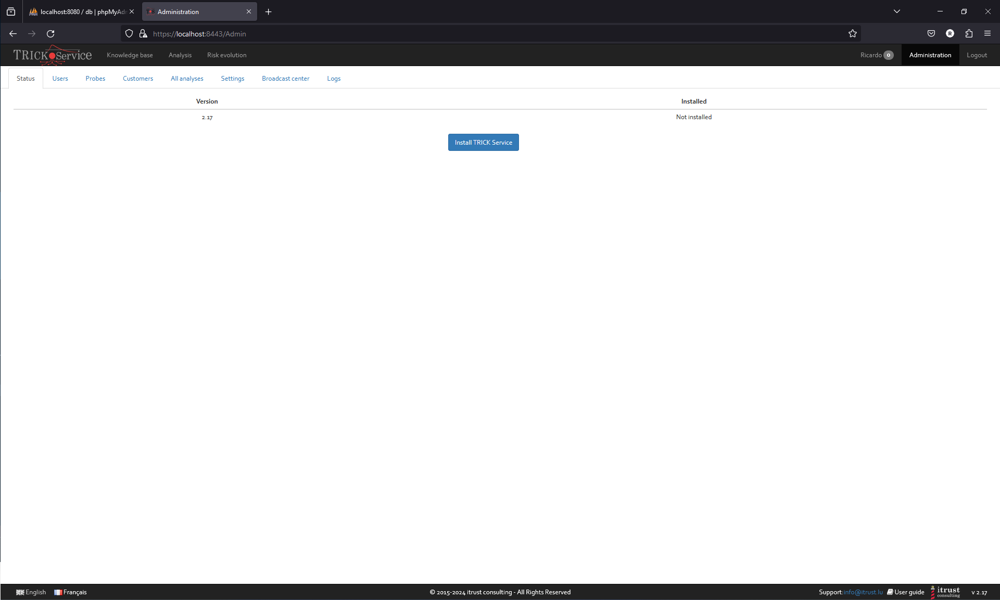

To verify that the installation was successful, click on ```Knowledge base``` and verify that the list under ```Analysis profile``` has been updated.

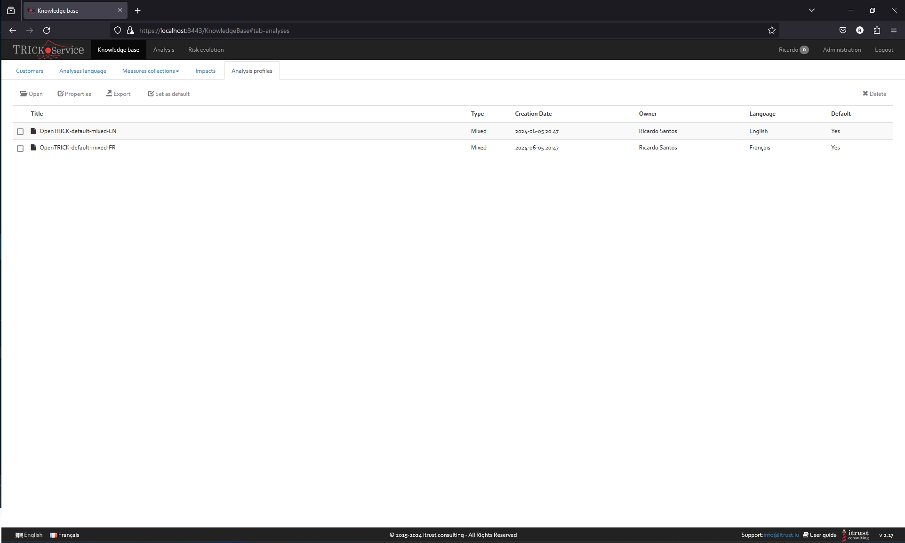

Finally, you can refer to the [User Guide to create your first risk analysis](https://localhost:8443/static/user-guide.html#creating-a-risk-analysis-using-trick-service).